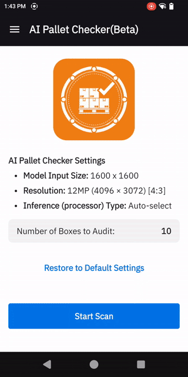
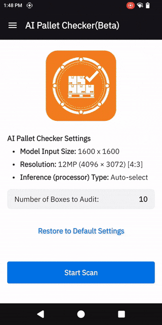

# AI Pallet Checker (Beta)

**AI Pallet Checker (Beta)** is a sample Android application that demonstrates how to use Zebra's AI Data Capture SDK to automate pallet auditing and box-level inventory verification in warehouse environments. This project shows how to combine two foundational models — the **Pallet and Box Localizer** and the **Barcode Decoder** — with Jetpack Compose and MVVM architecture for modern, enterprise-grade pallet verification, across a high-resolution **Snap** phase and an optional live **Wand Audit** phase.

## Project Purpose
Use this project as a sample for:
- Initializing and configuring Zebra's AI Data Capture SDK with multiple models at once
- Processing high-resolution snapshots and live camera frames with different foundational AI models
- Validating decoded barcodes against a user-configured product/quantity rule set
- Displaying real-time detection and validation results in a Compose UI
- Managing state and business logic with MVVM

## Demo Overview

| Configuration |                                                                                                             Pallet Checking in Action                                                                                                              |
|:-------------:|:--------------------------------------------------------------------------------------------------------------------------------------------------------------------------------------------------------------------------------------------------:|
|  |                                                                                                                                                                              |
| The configuration screen allows you to set up the Product SKU barcode prefix, the optional Quantity barcode prefix and the expected box count before starting a scan. | Once configured, the application captures a high-resolution image of the pallet to identify each box and decode its barcode. Any boxes not captured in the initial scan can then be manually scanned with the device during a timed audit session. |

## How It Works

1. **[CameraX](https://developer.android.com/media/camera/camerax) Integration**: The app uses CameraX for camera lifecycle, high-resolution capture and frame analysis.
2. **Pallet and Box Localizer + Barcode Decoder**: Frames are analyzed in real-time by Zebra's models, managed by `ModelsStorage` with a configurable processor order (DSP / GPU / CPU) and intelligent fallback; `PalletProcessHelper` converts detections into `PalletBox` results.
3. **Two-Phase Workflow**: The snap phase captures a single high-resolution image and re-snaps automatically (up to 3 attempts) when primary barcodes are missing, merging the results; the wand phase then collects the remaining barcodes from live frames within a timed session using barcode voting and timed finalisation.
4. **MVVM Architecture**: All SDK interactions are isolated in the helper layer. ViewModels manage state and expose it to the UI via Kotlin Flows.
5. **Jetpack Compose UI**: The UI observes ViewModel state and displays overlays with colour-coded bounding boxes and decoded barcode values for detected boxes. Touch interactions allow users to configure the demo, capture, and start an audit.

## Getting Started

### Prerequisites
- Android Studio Hedgehog or later
- Android 13 (API 33) or higher required on device
- Zebra AI Data Capture SDK ([Documentation](https://techdocs.zebra.com/ai-datacapture/latest/about/))

### Setup & Installation
1. **Clone the repository:**
   ```bash
   git clone <repository-url>
   cd AI_Pallet_Checker
   ```
2. **Open in Android Studio:**
   - Select "Open an Existing Project" and choose the project directory.
3. **Build the project:**
   ```bash
   ./gradlew build
   ```
4. **Run on device:**
   - Connect an Android device with a camera and run the app from Android Studio.

## Usage Overview

- **Home Screen:** Dashboard showing the active settings (model input size, camera resolution, processor, expected box count) and the entry point to start a scan.
- **ViewFinder:** Point the camera at the pallet and tap Capture, or let auto-capture trigger on pallet-base detection, a fixed box count, or a percentage of the expected count. Detection overlays appear for boxes and the pallet base.
- **Configure Demo:** Set up the Product SKU barcode prefix, the optional Quantity barcode prefix and expected quantity.
- **Settings:** Model input size, camera resolution, processor type, barcode symbologies, AI barcode decode toggle, Picture-in-Picture and live-box toggles, auto-capture criteria.
- **Results:** View the snap image with colour-coded bounding boxes and a per-box list of barcode values and validation status — green (verified), yellow (pending audit), red (failed validation), purple (invalid) — and start a wand audit for any pending boxes.
### Usecase Demos
**Snap Phase** - Pallet and Box Localization + Barcode Decode:
- Point the device at a pallet in the **ViewFinder** and tap **Capture**, or let auto-capture trigger.
- Detects every visible box plus the pallet base in a single high-resolution snapshot and decodes the barcodes on each box.
- Automatically re-snaps up to 3 times when primary (SKU) barcodes are missing and merges the results before proceeding to **Results**.
- Displays the snap image with colour-coded bounding boxes alongside a per-box list of barcode values and validation status.

**Wand Audit Phase** - Live Barcode Recovery:
- Started from **Results** with **Start Audit**, for any boxes left pending after the snap.
- The user "wands" the device across each pending box individually; barcodes are decoded from live frames and each box colour updates as it is verified.
- A countdown timer bounds the audit session; on finalisation the **Results** screen shows the updated states.
- Optional **Picture-in-Picture** overlay and **live bounding boxes** provide real-time audit feedback.

#### Box Validation States
Each box is matched against the configured **Product SKU** barcode prefix and optional **Quantity** barcode prefix, and rendered with a colour-coded status:

| Colour | Meaning |
| ------ | ------- |
| 🟢 Green | Verified — the primary (SKU) barcode and secondary barcode have both been successfully found and verified. |
| 🟡 Yellow | Pending Audit — the primary or secondary barcode has not yet been decoded and requires a manual audit. |
| 🔴 Red | Failed Validation — the primary or secondary barcode failed to satisfy the required conditions. |
| 🟣 Purple | Invalid — The Primary SKU and Quantity Barcode features are not enabled. |
## Documentation & Support
- [Zebra AI Data Capture SDK Documentation](https://techdocs.zebra.com/ai-datacapture/latest/about/)
- [Jetpack Compose Documentation](https://developer.android.com/jetpack/compose)
- [CameraX Documentation](https://developer.android.com/training/camerax)
- [Android Developer Documentation](https://developer.android.com/docs)

---

*This project is a sample implementation of Zebra's Pallet and Box Localizer and Barcode Decoder models. For questions or support, please refer to Zebra's developer resources or open an issue in this repository.*
